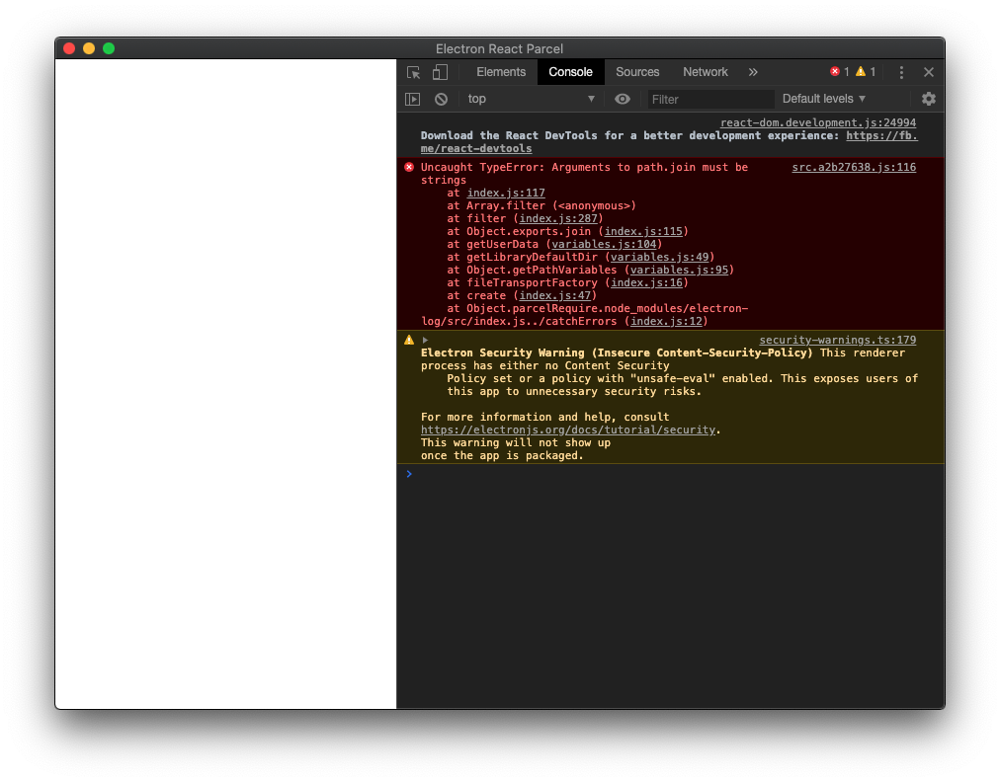

# Importing `electron-log` causes error: `Uncaught TypeError: Arguments to path.join must be strings`



## To Reproduce:

1. `yarn`
2. `yarn start`

## File of Interest

[`./src/App.js`](./src/App.js)

```js
import React, { Component } from "react";
import Navbar from "./components/Navbar";
import Custom from "./components/Custom";
import "./custom.css";

import log from 'electron-log';

class App extends Component {
  render() {
    return (
      <div>
        <Navbar />
        <Custom />
      </div>
    );
  }
}
export default App;

```

## Error:

### Browser JS Console:

```js
Uncaught TypeError: Arguments to path.join must be strings
```

## Environment

| Software         | Version(s) |
| ---------------- | ---------- |
| Parcel           | 1.12.4
| Node             | v14.0.0
| Yarn             | 1.22.4
| Operating System | Mac OS X Catalina 10.15.3